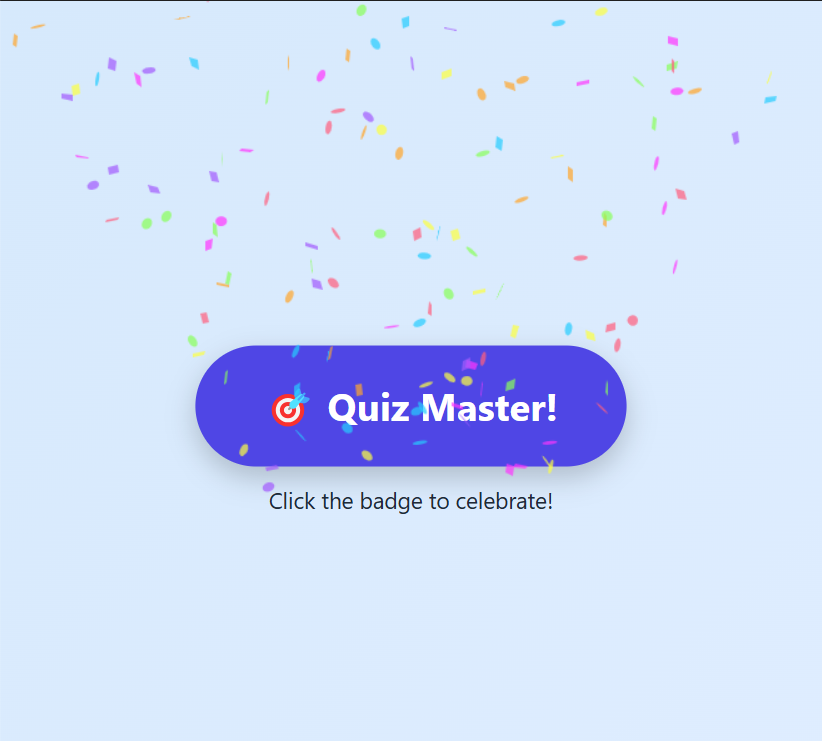

# Rise Badge Generator

A simple web badge with confetti animation to celebrate learning achievements!

## How it works
- HTML/CSS layout for badge
- JavaScript triggers confetti using [`canvas-confetti`](https://www.skypack.dev/view/canvas-confetti)
- Click the badge to celebrate 🎉

## Tech Used
- HTML
- CSS
- JavaScript
- canvas-confetti (CDN)

## Preview

 

## Future Ideas
- More badge names (e.g., “Streak Champ”, “Fast Finisher”)
- Sound or sparkle animations
- LMS or Rise integration
